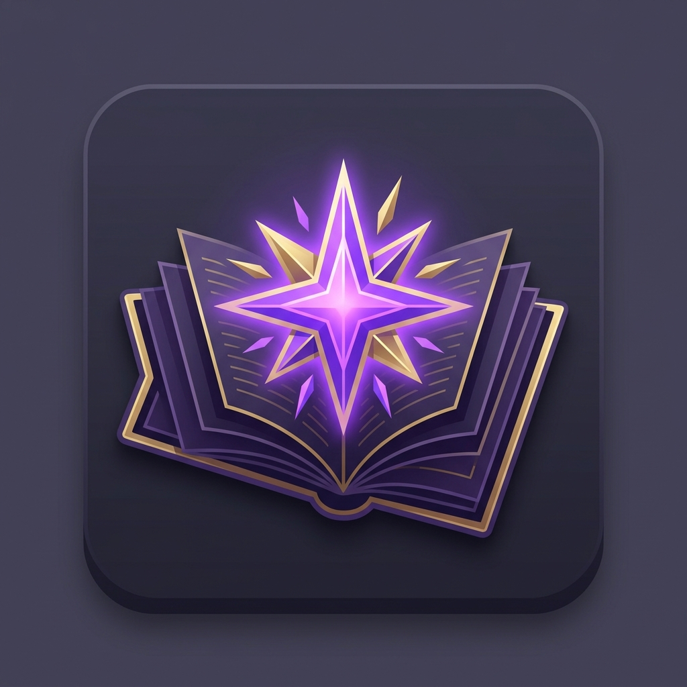

<p align="center">
  
</p>

# StudyRAG 🚀

[](https://flutter.dev)
[](https://fastapi.tiangolo.com)
[](https://en.wikipedia.org/wiki/Model–view–viewmodel)

**StudyRAG** is a premium, AI-powered study assistant designed to help students master their subjects through Retrieval-Augmented Generation (RAG). It transforms your static notes into an interactive knowledge base with automated flashcards, quizzes, and visual analytics.

---

## ✨ Key Features

### 🧠 Subject-Aware AI Chat (RAG)
*   Ask questions directly to your uploaded notes.
*   "Exam Mode" for strict, syllabus-focused tutoring.
*   Asymmetric, modern chat UI for intuitive interaction.

### 🃏 AI Flashcard Generation
*   Automatically generate flashcards from PDFs and images.
*   Spaced Repetition System (SRS) for long-term retention.
*   Tinder-style swipe interface for active recall.

### 📝 Interactive AI Quizzes
*   Dynamic MCQ generation based on note content.
*   Real-time scoring and performance summary.
*   Progressive difficulty scaling.

### 📊 Study Analytics
*   Weekly activity tracking with interactive bar charts.
*   Retention trend lines to visualize your progress.
*   Mastery stats for every subject.

### 📅 Intelligent Exam Planner
*   Automated notification system for upcoming exams.
*   Color-coded urgency badges (Red/Orange/Green).

---

## 🎨 UI/UX Design

Built with a **Premium Glassmorphism** aesthetic:
*   **Sleek Dark Mode**: Deep slate and neon violet palette.
*   **Floating Navigation**: Custom frosted-glass bottom navbar.
*   **Smooth Animations**: Staggered list entries and micro-interactions powered by `flutter_animate`.

---

## 🛠 Technology Stack

### Frontend (Flutter)
*   **State Management**: `flutter_riverpod` (MVVM Architecture)
*   **Navigation**: Custom Floating Glass Navbar
*   **Database**: `Hive` (High-speed local persistence)
*   **Charts**: `fl_chart`
*   **Typography**: `Google Fonts (Inter)`

### Backend (Python/FastAPI)
*   **Core**: FastAPI for high-performance async requests.
*   **LLM**: OpenAI/LangChain for RAG and content generation.
*   **OCR**: Automated text extraction from images and PDFs.

---

## 🚀 Getting Started

### Prerequisites
*   [Flutter SDK](https://docs.flutter.dev/get-started/install)
*   [Python 3.10+](https://www.python.org/downloads/)

### Installation

1.  **Clone the repository**:
    ```bash
    git clone https://github.com/dj2313/StudyRAG.git
    cd StudyRAG
    ```

2.  **Setup Backend**:
    ```bash
    cd studyrag/backend
    python -m venv venv
    source venv/bin/activate # or venv\Scripts\activate on Windows
    pip install -r requirements.txt
    # Configure your .env file with API keys
    uvicorn app.main:app --reload
    ```

3.  **Setup Frontend**:
    ```bash
    cd ../../persona
    flutter pub get
    flutter run
    ```

---

## 🏗 MVVM Clean Architecture
The project follows a strict separation of concerns:
*   **Models**: Data entities and schemas.
*   **Views**: UI components and screens.
*   **ViewModels**: Riverpod providers managing state and business logic.
*   **Services**: API and storage handlers.

---

## 📝 License
This project is licensed under the MIT License - see the [LICENSE](LICENSE) file for details.

---

## 🤝 Contributing
Contributions are welcome! Feel free to open an issue or submit a pull request.

---

*Made with ❤️ by [dj2313](https://github.com/dj2313)*
